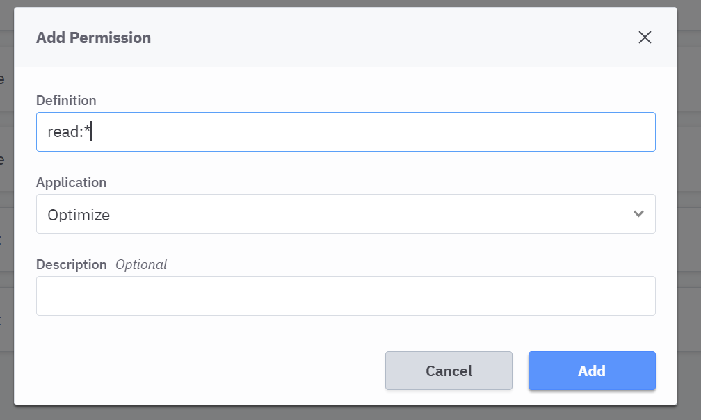
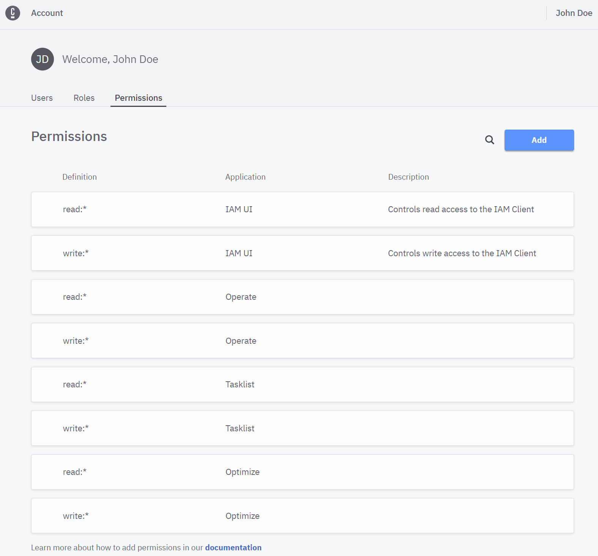
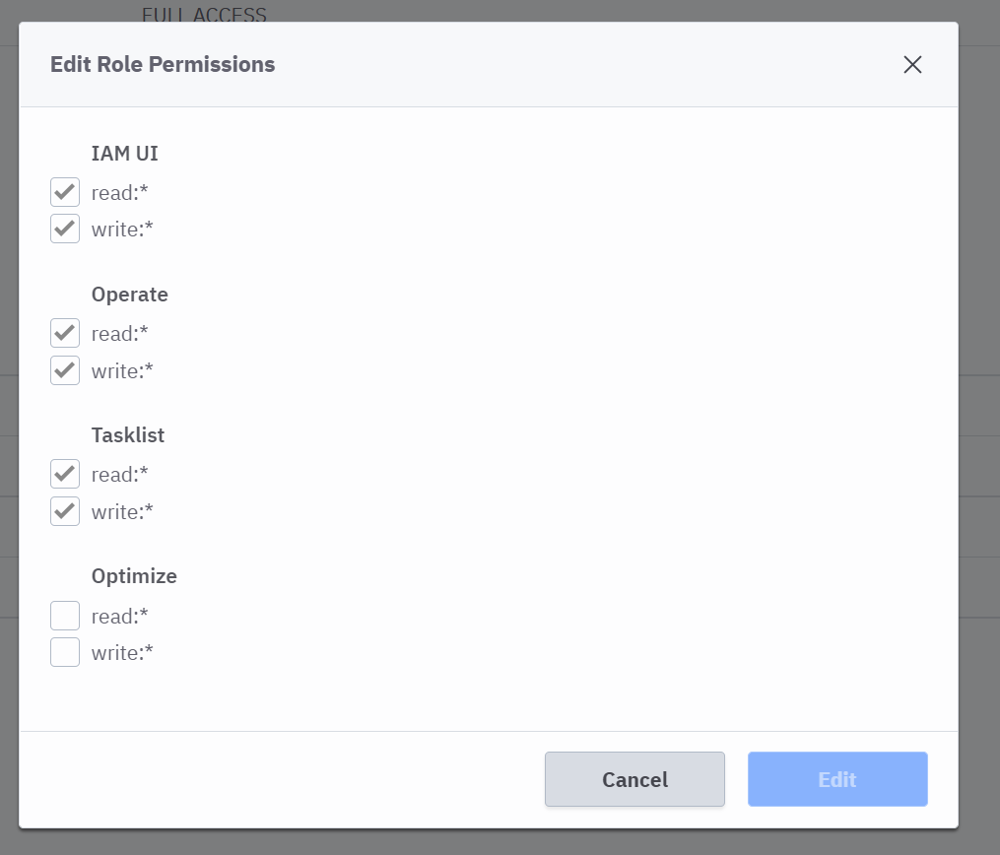

# Camunda Cloud Self Managed Docker Compose
docker-compose file to stand up a complete Camunda Cloud Self Managed (Zeebe, Elasticsearch, Operate, Tasklist, IAM, IAM database, and Optimize) environment for development purposes. Note, it has been tested with Zeebe, IAM, Operate, and Tasklist v1.3.4 and Optimize v3.7.1.

Clone this repo and update your hosts files to include:

```
127.0.0.1	iam-backend.local
127.0.0.1	iam-database
```

Issue the following command to start up your environment:

```
docker-compose -f ccsm-all.yml up -d
```

Wait a few minutes for the environment to start up and settle down. Open a browser and navigate to 

[http://iam-backend.local:9090](http://iam-backend.local:9090)

Login as demo/demo.

You'll need to add read and write permissions for Operate, Tasklist, and Optimize. Click on the Permissions tab. Next, click on the Add button and enter 'read:*' permission for Optimize in the Definition field. Click on 'Add' to save the permission.



Repeat by adding a 'write:*' permission for Optimize.
Repeat adding read and write permissions for Operate and Tasklist. Your screen should look something like this:



Add those permissions to the lone Role available. Click on the Roles tab and within the tab click on the FULL ACCESS role. Next, click on the Edit button to update the role permissions. Add the permissions by clicking on the checkboxes by each permission:




Click on Edit to save the updates.

Now you can navigate to Operate (http://localhost:8081), Tasklist (http://localhost:8082), and Optimize (http://localhost:8090) and you'll notice you're using IAM to log into each application.

The trick here is that IAM and Zeebe require separate networks as you'll see in the docker-compose file. You'll also notice in the zeebe-application.yml file there are two exporters defined, one for Operate and Tasklist and one for Optimize. Feedback and updates are welcome!